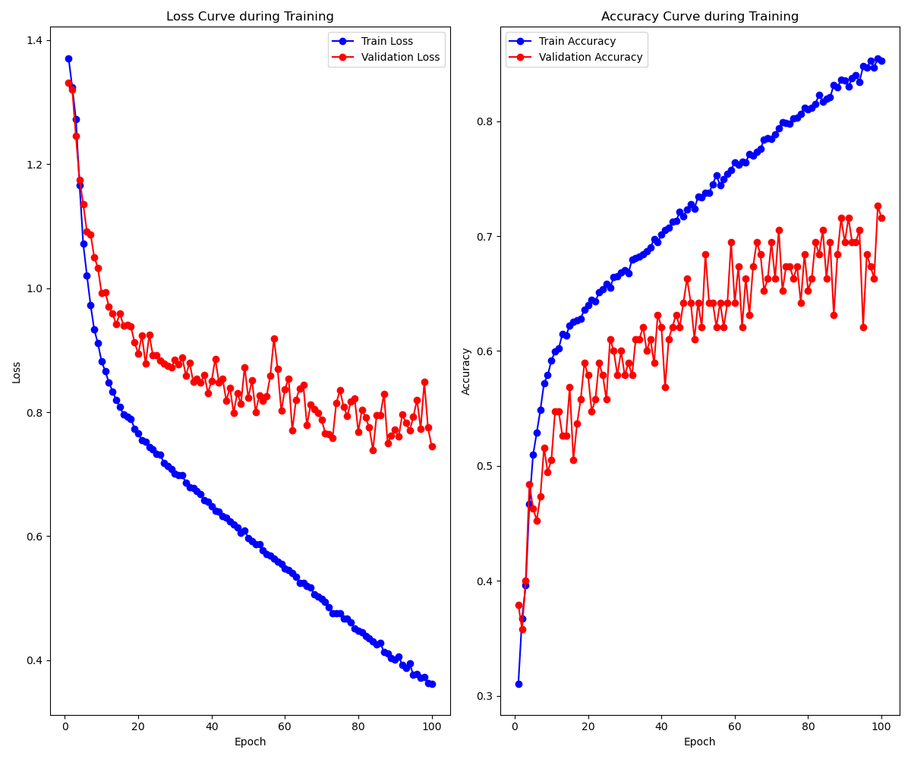

# LeNet Implementation for Alzheimer's Brain Image Classification

## Overview

This project explores the capabilities of the classic LeNet architecture beyond its original design scope. 

While LeNet was originally developed for handwritten digit recognition (MNIST dataset) using small 32x32 grayscale images, this implementation challenges the network with a more complex medical imaging task: classifying Alzheimer's disease stages from brain MRI scans.

The implementation serves as a technical showcase for medical image analysis workflows with MLOps integration.

## Key Features
- **Adapted LeNet Architecture**: Customized for 3-channel medical images with dynamic input sizing
- **MLOps Pipeline**:
  - End-to-end training with validation metrics (accuracy, recall, F1-score)
  - S3 integration for data storage and model artifacts
  - SageMaker compatible training pipelines
- **Medical Imaging Features**:
  - Specialized preprocessing for MRI images
  - Four-class classification (Alzheimer's stages)
  - High-resolution image support (128x128 + resizing)
  
## Dataset
- **Alzheimer's MRI Image Collection**
- Class distribution: 4 stages of Alzheimer's progression
- Preprocessing pipeline:
  - Resize to 32x32 pixels
  - RGB normalization (mean=0.5, std=0.5)
  - Folder-based dataset organization
  - Data splitted by 70/15/15 for train, test validation


## Architecture Details
```python
LeNet(
  (conv1): Conv2d(3, 6, kernel_size=(5, 5))
  (conv2): Conv2d(6, 16, kernel_size=(5, 5))
  (fc1): Linear(in_features=16*N², out_features=120)
  (fc2): Linear(120, 84)
  (fc3): Linear(84, num_classes)
)
```
- Dynamic spatial adaptation for varying input sizes
- ReLU activation with max-pooling
- Cross-entropy loss with Adam optimizer
- Weight decay in Optimizer (0.0001)

## Technologies Used
- **Core ML**: PyTorch 2.2, CUDA acceleration
- **Cloud**: AWS SageMaker, S3 storage
- **MLOps**: Weights & Biases tracking, model checkpointing
- **Data Pipeline**: Custom FolderBasedDataset, TorchVision transforms

## Results

#### Hyperparameters
| Name           | Value   |
|----------------|--------:|
| num_classes    | 4       |
| learning_rate  | 0.0001  |
| epochs         | 100     |
| batch_size     | 32      |
| resize         | 32      |
| dropout        | 0.3     |
| weight_decay   | 0.0001  |

#### Metrics
| Name         | Value    |
|--------------|---------:|
| accuracy     | 0.85236  |
| loss         | 0.36243  |
| val_accuracy | 0.71579  |
| val_loss     | 0.74491  |
| val_f1       | 0.74757  |
| val_recall   | 0.74153  |

